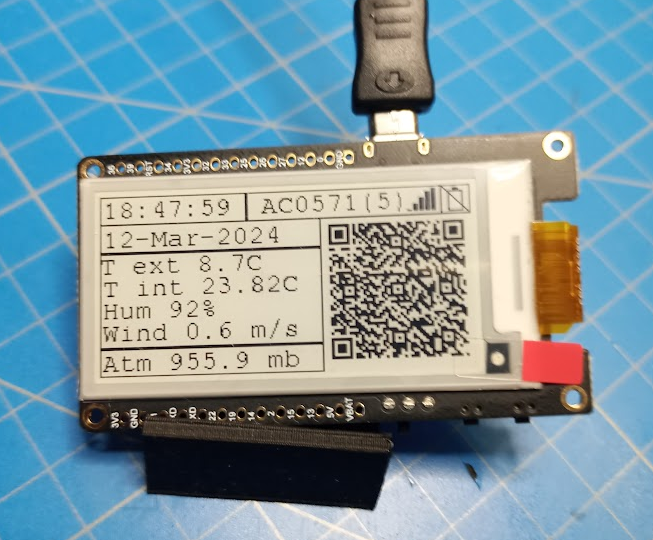

The LiLyGo T5 Weather Station is a compact and versatile device designed to provide accurate real-time weather data for both indoor and outdoor environments. Equipped with advanced sensors including temperature, humidity, pressure, and light sensors, the LiLyGo T5 Weather Station offers comprehensive monitoring capabilities. Its sleek design makes it ideal for placement in homes, offices, or outdoor settings. With its user-friendly interface and compatibility with various platforms, users can easily access and analyze the gathered weather information. Whether you're a weather enthusiast, gardener, or simply interested in keeping track of atmospheric conditions, the LiLyGo T5 Weather Station is a reliable and convenient tool for staying informed about the weather.

